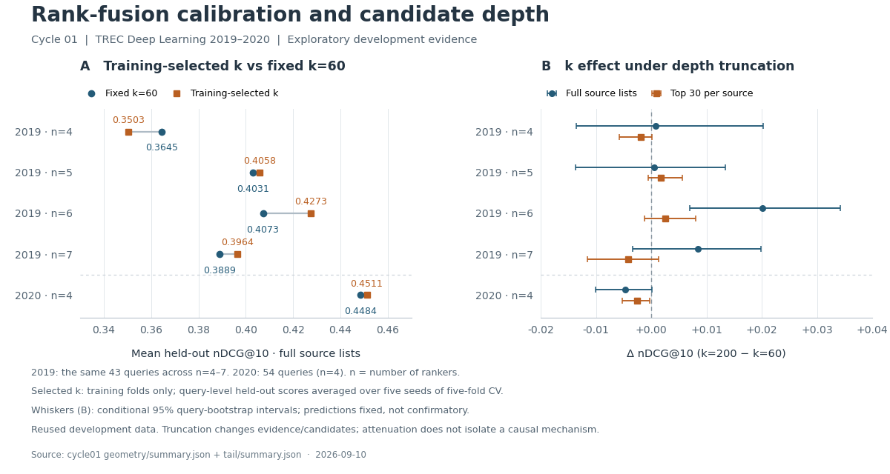

# Cycle 01: what counts as independent evidence?

Research checkpoint, 2026-09-10. **A narrow k-tuning gain survives correction,
but it does not solve the original problem of useful dissent versus repeated
evidence.** A second experiment shows that list depth matters and that the
available judgments cannot reliably distinguish isolated specialists from
specialists corroborated deeper in other lists. These results change what we
should measure next; they do not establish a new retrieval method.

## Original question and recursive loop

The earliest recovered user-supplied design, from February 13 before this repo's
first commit, combines a consensus field with a specialist escape field and an
anti-cabal uniqueness term. The durable question is whether a useful minority
can survive without rewarding correlated noise. [Origin](../../_sessions/ORIGIN.md)
records the provenance and the limits of what was recovered.

This cycle used one native Fable 5.1 Claude coordinator, four parallel Opus 5
scouts for experimental design, Codex implementation and independent audits,
then a second phase in the same Claude session to challenge measured results.
The design critique changed the experiments: exact asymptotic ordering and a
depth/tail-evidence extension replaced vague claims about correlation correction.
Review errors were checked and explicitly rejected too. See
[design receipt](../../_sessions/evidence/2026-09-10-cycle01-design-receipt.json)
and [source checks/integration corrections](../../_sessions/cycles/2026-09-10-cycle01-sources.md).

## One comparison contract



[Vector figure](overview.svg) · [figure reproduction script](plot_cycle01.py)

The grid was canonical k∈{1,5,10,30,60,100,200,500}, one-based ranks,
document-ID tie breaks, and the same supplied candidate runs. Five-fold
training-only selection ran for seeds 42, 123, 7, 99, 2026. Each query's out-of-fold
scores were averaged across seeds. Four 2019 ensembles were averaged within
query before any aggregate interval: there are 43 queries, not 172 independent
observations. DL2020 has 54 queries and only the four lexical rankers.

NDCG@10 uses exponential graded gains and treats unjudged documents as zero
for this ranking metric. Partial judgments remain a material limitation.
Intervals below are descriptive 4,000-resample query bootstraps conditional on
saved predictions; they do not include full training-selection uncertainty or
make heavily reused development data confirmatory. No new p-values are claimed.

Historical zero-based local k60 corresponds to canonical k59. Document-ID tie
handling also changes the 2020 baseline slightly, from 0.4483236 to 0.4483866.
The original RRF paper itself reports pilot testing of k before fixing 60 for
validation; tuning k is not a novelty claim.
[Original paper](https://cormack.uwaterloo.ca/cormack/cormacksigir09-rrf.pdf)

## 1. A local gain survives; broad improvement remains unestablished

| Configuration | Queries | Fixed k60 | Training-selected k | Δ NDCG@10 | Conditional 95% interval |
| --- | ---: | ---: | ---: | ---: | --- |
| DL2019 · 4 rankers | 43 | 0.3645 | 0.3503 | -0.0142 | [-0.0316, -0.0021] |
| DL2019 · 5 rankers | 43 | 0.4031 | 0.4058 | +0.0026 | [-0.0041, +0.0096] |
| DL2019 · 6 rankers | 43 | 0.4073 | 0.4273 | +0.0201 | [+0.0070, +0.0342] |
| DL2019 · 7 rankers | 43 | 0.3889 | 0.3964 | +0.0074 | [-0.0039, +0.0182] |
| DL2020 · 4 rankers | 54 | 0.4484 | 0.4511 | +0.0027 | [-0.0059, +0.0114] |

The six-ranker configuration chooses k200 in all 25 training folds. This is
valid CV; identical selections do not demonstrate leakage. An independent audit
reconstructed all 125 folds across the five configurations, their training-only
selections, OOF values, aggregate calculations, and file digests. The n4 loss
also reconstructs and is negative for all five seeds. Fold-dependent choices
can produce a lower OOF mean than any single fixed k's overall mean.

Across the four 2019 ensembles, the primary mean query delta is **+0.00399**,
conditional interval **[−0.00296,+0.01086]**. Both n4 cross-annual transfers lose:
2019-trained k100 gives −0.00253 on 2020; 2020-trained k10 gives −0.00207 on 2019.
Thus the configuration-specific signal is worth explaining, while general
improvement and independent-domain transfer remain unproved.

## 2. Smoothing does not supply source independence

RRF adds a term for every source. Copying one source adds that term again at
any finite k. In the one-extra-copy experiments, roughly 90% of source-copy
interventions change some part of the ordered top 10 at both k60 and 200. This
means any top 10 difference per intervention, not 90% of documents displaced.
Signed relevance effects are mixed; invariance and relevance quality differ.

A five-document construction holds every source's candidate set identical and
reverses x versus y after copying a source, for every finite k≥0. Its score
comparison reduces to the sign of 1/(k+1) − 1/(k+5). The example rules out clone
invariance from k tuning even without missing candidates. It does not prove
that greater k always increases empirical duplication sensitivity.

Collapsing exact ordered-list duplicates is invariant by construction and passes
all interventions. This is a diagnostic baseline, not a demonstrated solution
to source reliability. Independently obtained identical results need not be
mere copies; provenance or a dependence model supplies information a list alone
cannot provide.

The exact eventual RRF ordering as real k→∞ follows coverage descending,
then rank sum ascending, squared-rank sum descending, and further alternating
moments as needed. The coverage/rank-sum pair alone is insufficient. The n6
k200 top 10 matches this exact limit on only 7/43 queries, so its gain cannot be
explained as simply reaching the limiting regime.

## 3. Deep-list evidence matters, but its meaning is unresolved

The frozen follow-up compares fixed k60 and 200 on full supplied lists, on lists
truncated to each query's shortest source, and on per-source top 30 caps.

| Configuration | Full-list k200−k60 | Top30 k200−k60 | Change in k effect |
| --- | ---: | ---: | ---: |
| DL2019 · 4 rankers | +0.0008 | -0.0019 | -0.0027 |
| DL2019 · 5 rankers | +0.0005 | +0.0017 | +0.0012 |
| DL2019 · 6 rankers | +0.0201 | +0.0026 | -0.0175 |
| DL2019 · 7 rankers | +0.0085 | -0.0042 | -0.0127 |
| DL2020 · 4 rankers | -0.0047 | -0.0025 | +0.0022 |

For n6, capping at 30 reduces the k effect by −0.01750, conditional interval
[−0.03046,−0.00555]. Truncation removes evidence and changes candidate sets;
this is an interaction, not an isolated causal proof of useful tail agreement.
Per-query output records entrants, exits, and pure reorderings, including each
document's source ranks under both full and truncated conditions.

**The equal-depth arm is a no-op.** Every source already has the same length
within each query. The previously noted 5–200 range describes variation between
queries. Unequal source lengths cannot explain the observed full-list effect
on these inputs. Equal lengths still permit different candidate sets.

A specialist candidate is top 10 in one source and absent from all other top 30
lists. It is tail-supported if some other source contains it below 30, and
isolated if every other source omits it. Groups are defined on original full
lists without labels. The evidence available for comparing their relevance is:

| Configuration | Supported candidates / judged | Isolated candidates / judged | Pooled relevant≥2 among judged, supported / isolated | Queries with judged examples in both groups |
| --- | ---: | ---: | ---: | ---: |
| DL2019 · 4 rankers | 99 / 29 | 8 / 2 | 37.9% / 0.0% | 1 |
| DL2019 · 5 rankers | 229 / 71 | 69 / 7 | 40.8% / 0.0% | 5 |
| DL2019 · 6 rankers | 306 / 78 | 91 / 6 | 32.1% / 16.7% | 4 |
| DL2019 · 7 rankers | 416 / 90 | 105 / 6 | 35.6% / 16.7% | 4 |
| DL2020 · 4 rankers | 121 / 55 | 9 / 7 | 10.9% / 28.6% | 5 |

Pooled 2019 rates look promising, but judgments are sparse and very uneven;
the pooled direction reverses in 2020. Within-query judged comparisons contain
only 1–5 eligible queries per configuration. A zero-width bootstrap interval in
a tiny all-zero stratum is degenerate resampling, not proof of no uncertainty.
Source identity, owner rank, query, and the judgment process remain confounders.
The present evidence does not justify training a new specialist gate or claiming
that tail support identifies correctness. The output also reports unjudged-zero
metrics and owner-rank strata so the denominator choice stays inspectable.

## Reproducibility and claim boundaries

Two protocols were frozen before their respective runs. The tail extension was
chosen after the geometry results, so it is explicitly an exploratory follow-up.
Each directory contains start/end source and input digests, exact argv, Python
version, Git HEAD plus dirty-file status, output digests, and per-query evidence.
Old specifications, May probes, supplied runs, and historical results were not
rewritten to fit this cycle.

From the repository root, choose fresh output directories; existing result
artifacts must not be overwritten:

```bash
python3 -B -m unittest discover -s evaluation/tests -v
python3 -B evaluation/cycle01_rank_geometry.py --output /tmp/ic-rrf-geometry-reproduction
python3 -B evaluation/cycle01_tail_evidence.py --protocol _sessions/cycles/2026-09-10-cycle01-tail-protocol.md --output /tmp/ic-rrf-tail-reproduction
```

The research suite contains 25 tests covering independent comparison fixtures,
held-out label boundaries, exact-tie geometry, clone invariance, group eligibility,
judgment denominators, depth behavior, and immutable tail output. Independent
review also recomputed selected rankings with rational arithmetic and a separate
NDCG calculation. Hashes establish current evidence custody, not reproducibility
of regenerating the original runs: the character-hash generator's Python hash
randomization remains unresolved.

Current limitations include small related MS MARCO query sets, generated lexical
and character-hash rankers, extensive prior selection, partial judgments, and no
untouched-domain evaluation. The legacy PQAS selection/statistics pipeline was
not repaired in this cycle. The geometry duplicate helper lacks the main loop's
positive-qrel eligibility filter; all current queries have positive qrels, so
current outputs are unaffected. Align it before reusing on a different panel.

## Next frontier and stopping decision

The research question now needs a better observation plan: **when a source
disagrees, what lets us tell whether it contributes different useful evidence?**
This separates three concepts that earlier prose blurred: observed agreement,
source dependence, and correctness. Naming them separately makes new tests
possible without claiming that the terminology itself solves the problem.

The next step is a bounded source-feasibility pass, followed only if warranted
by an experiment with one meaningfully different neural/dense retrieval source.
Check actual judgment coverage and candidate access before designing a specialist
gate. New source provenance may help; it does not guarantee independence or
correctness. The [cycle02 proposal](../../_sessions/cycles/cycle02-source-feasibility.md)
defines the inventory, alternatives, precision decision, and prospective oracle
scope. Dependence-aware ensemble learning is an existing adjacent field to
understand before claiming a new approach.
[Jaffe et al., AISTATS 2016](https://proceedings.mlr.press/v51/jaffe16.html)

This is a meaningful checkpoint: the local effect is reproduced, a proposed
mechanism is bounded by a counterexample, a follow-up reveals insufficient
observations, and the next action changes the evidence rather than repeating
the same sweep. The broader agent/LLM branch remains welcome, with its own
controlled task and outcome metrics. Nothing in this cycle measures agent gains.

The resumed Claude review completed with one Opus 5 evidence scout and Fable 5.1
synthesis. Both research phases succeeded in the same native coordinator session;
their combined native list-price accounting is $5.29422225, not a subscription
charge. Context markers and lifecycle events were verified and the coordinator
recorded consumption for the exact requests, as Claude had no shell tool.
[Review receipt](../../_sessions/evidence/2026-09-10-cycle01-review-receipt.json)
preserves requested/observed models and outcome. No provider process remains
running. Read-only collaboration and manual native resume were verified;
autonomous peer wakeup, Claude code editing, and a permanent listener were not.
