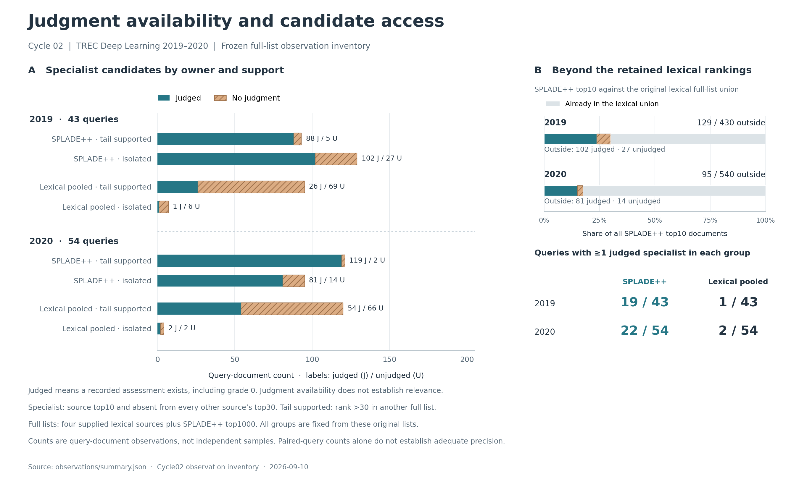

# Cycle02: better observations reveal a different ambiguity

SPLADE++ supplies a substantially better observed specialist slice: 19 of 43
DL2019 queries and 22 of 54 DL2020 queries contain judged examples of both
tail-supported and isolated SPLADE specialists. However, those two groups also
separate documents present in the old lexical candidate union from documents
absent from it. This inventory opens a descriptive comparison; it does not
identify a causal benefit of corroboration or establish a fusion improvement.

This cycle followed the [frozen observation protocol](../../_sessions/cycles/2026-09-10-cycle02-observation-protocol.md).
It measured candidate access and judgment availability only. A judged document
may have relevance grade zero. No ranking metric, relevance rate, oracle,
hyperparameter selection, or effect test was computed.

## What entered the laboratory

We considered exactly three families by provenance and access, then selected
Castorini's cached SPLADE++ EnsembleDistil source before downloading run bodies
or measuring coverage. Both raw files matched their pinned sizes and SHA256s:
42,988,709 bytes combined, containing 43,000 and 54,000 ranking rows. All 97
queries have exactly 1,000 candidates; every query has at least one equal-score
adjacent pair. Conversion preserves the supplied candidate order, including
ties, and emits only query/document IDs, scores, and one-based ranks.

SPLADE++ is neural sparse retrieval. It differs from the hand-built lexical
functions, but a different representation is not proof of independent errors
or useful expertise. Its documented retrieval path has corpus-wide access;
the four old sources rerank a supplied candidate pool and retain up to 200
documents. The exact historical cache-generation command and index/encoder
digests remain unknown. Raw passage/query text stays in ignored local storage.

The [source investigation](../../_sessions/cycles/2026-09-10-cycle02-source-notes.md),
[selection](../../data/cycle02/source-selection.json), and
[acquisition manifest](../../data/cycle02/acquired/source-manifest.json)
record the checked primary sources, alternatives, limits, and verified bytes.

## Observation result

A specialist is an original source top10 document absent from every other
source's original top30. It is tail-supported if any other supplied list
contains it below rank 30, and isolated otherwise. These labels describe
truncated observations, not absence from the entire corpus.

Counts below are **judged / candidate query-document pairs**. The final column
counts queries with at least one judged example in each group; it is not a
power or precision certificate.

| Year and specialist owner | Tail-supported | Isolated | Queries with judged examples in both groups |
| --- | ---: | ---: | ---: |
| 2019 SPLADE++ | 88 / 93 | 102 / 129 | 19 / 43 |
| 2019 pooled lexical | 26 / 95 | 1 / 7 | 1 / 43 |
| 2020 SPLADE++ | 119 / 121 | 81 / 95 | 22 / 54 |
| 2020 pooled lexical | 54 / 120 | 2 / 4 | 2 / 54 |

All existing qrel queries are eligible; none were omitted. The SPLADE groups
are much more observable than the lexical groups within this five-source
inventory. Comparisons with cycle01 involve changed sources and changed cohorts,
so they are not a controlled estimate of the source's effect on observability.
Pooled counts are not independent samples, and the annual panels remain
previously explored development data.

The new source also brings highly ranked candidates absent from all four old
lists:

| Year | SPLADE top10 outside original lexical union | Judged among these | Judged across all SPLADE top10 |
| --- | ---: | ---: | ---: |
| 2019 | 129 / 430 (30.0%) | 102 / 129 (79.1%) | 398 / 430 (92.6%) |
| 2020 | 95 / 540 (17.6%) | 81 / 95 (85.3%) | 524 / 540 (97.0%) |

These are availability measurements, not relevant-document counts. The
[query-level artifact](observations/per_query.json) retains IDs, original and
active ranks, and judgment membership so each count can be challenged.

## What equalizing depth actually does

The secondary arm caps every list to the shortest supplied depth, at most 200.
All four lexical lists already have equal length within each query, so this
intervention changes only SPLADE: every one of the 43 and 54 queries is affected.
It changes the combined candidate set in every query as well.

| Year | Full union | Capped union | Outside lexical union, full → capped |
| --- | ---: | ---: | ---: |
| 2019 | 50,612 | 18,713 | 37,096 → 5,197 |
| 2020 | 63,719 | 23,661 | 46,741 → 6,683 |

All counts sum query-document pairs. Equal list length does not equalize candidate
access. The original specialist cohort and support labels remain fixed in both
arms; active visibility is reported separately. In 2019 the cap hides three
isolated SPLADE specialists, one judged. The two arms retain the same 19 and 22
queries with judged SPLADE examples in both groups. Cropping neither creates
new specialists nor reinterprets removed support as true isolation.

## The structural issue

Let `Lq` be the union of the four original lexical lists. Conditional on being
a SPLADE-owned specialist, the top30 exclusions already hold. Consequently:

- `isolated` means the document is outside `Lq`.
- `tail_supported` means it is inside `Lq`, at rank greater than 30 in every
  lexical list that contains it.

Support group and access to the recorded lexical candidate union are perfectly
coupled for this cohort. There is no within-access comparison between these
groups. More judgments could estimate their descriptive relevance association;
they would not by themselves separate corroboration from this access difference.
Matching list lengths also leaves the coupling intact. “Outside the union”
means outside the retained old rankings, not necessarily outside their upstream
retrieval pool.

## Review and next decision

Independent reconstruction verified all 97,000 conversion tuples, both derived
byte hashes, all specialist group denominators, and paired query eligibility.
It also checked the isolation/access identity query by query. The
[verification receipt](../../_sessions/evidence/2026-09-10-cycle02-independent-check.json)
states its scope; candidate-union tables were outside that bounded reconstruction.
The coordinator separately reconstructed candidate unions/intersections, source
depths and judgment counts, and pairwise overlaps for all 194 query/arm records.

The same Claude session resumed with a Fable5.1 coordinator and one Opus5 scout.
The review found an ambiguous visible-only label in the presentation digest,
which was clarified without changing numerical evidence. It also challenged
the initial impulse to abandon this observational contrast: an association can
still be measured, even though it cannot explain a causal support benefit.

We accepted that narrower next step, while correcting two statistical proposals.
Opposite missing-label assignments in the two groups are needed to bound their
difference; assigning both groups the same value misses the extremes. Rank-only
RRF also cannot supply a calibrated relevance-gap threshold for a specialist
weight. The [review integration](../../_sessions/cycles/2026-09-10-cycle02-review-integration.md)
records accepted findings and rejected overreach.

**Decision:** run one prospective relevance-association analysis on the fixed
SPLADE cohort, using all queries with both candidate groups (20 and 23), not just
the judged-pair subset. Bound every missing label in the unfavorable directions
and average within query before across queries. A ten-percentage-point gap is
the explicit project threshold for spending another cycle on fusion design;
it is not a predicted retrieval gain. A fixed uncertainty/precision rule allows
an inconclusive outcome and routes that outcome to the controlled known-truth
branch. The [cycle03 protocol](../../_sessions/cycles/2026-09-10-cycle03-specialist-association-protocol.md)
owns the full contract. It is prepared but not run at this checkpoint.

[Vector figure](observations.svg) · [plotting source](plot_observations.py).
The figure reads the frozen JSON and embeds source/script identities. Its
Matplotlib dependency is optional; acquisition and audit use the standard library.

## Reproduce and inspect

The [data instructions](../../data/cycle02/README.md) describe the pinned
acquisition and audit commands. Existing evidence directories are immutable;
use new output paths to reproduce them. The tools use the Python standard
library. The observation manifest records start/end hashes for code, protocol,
selection, acquisition manifest, runs, and qrels; all were unchanged during
the successful run. It also records the exact command, Python version, Git
parent, dirty input state, and output hashes.

- [Full summary](observations/summary.json) and [compact digest](observation-digest.json)
- [Completed manifest](observations/manifest.json)
- [Acquisition utility](../../_sessions/tools/acquire_cycle02_source.py)
- [Observation implementation](../../evaluation/cycle02_observation_audit.py)
- [Independent checker](../../_sessions/tools/check_cycle02_evidence.py), with
  `--check-only` after acquiring the ignored raw cache

No successor fusion algorithm or new performance claim is promoted by this cycle.

Validation: **67 tests pass** (38 research and 29 helper/acquisition tests).
The [check receipt](../../_sessions/evidence/2026-09-10-cycle02-checks.json) also
records frozen artifact custody, plot metadata, local links, and ignored raw
source/provider files. Historical inputs and cycle01 results remain unchanged.
