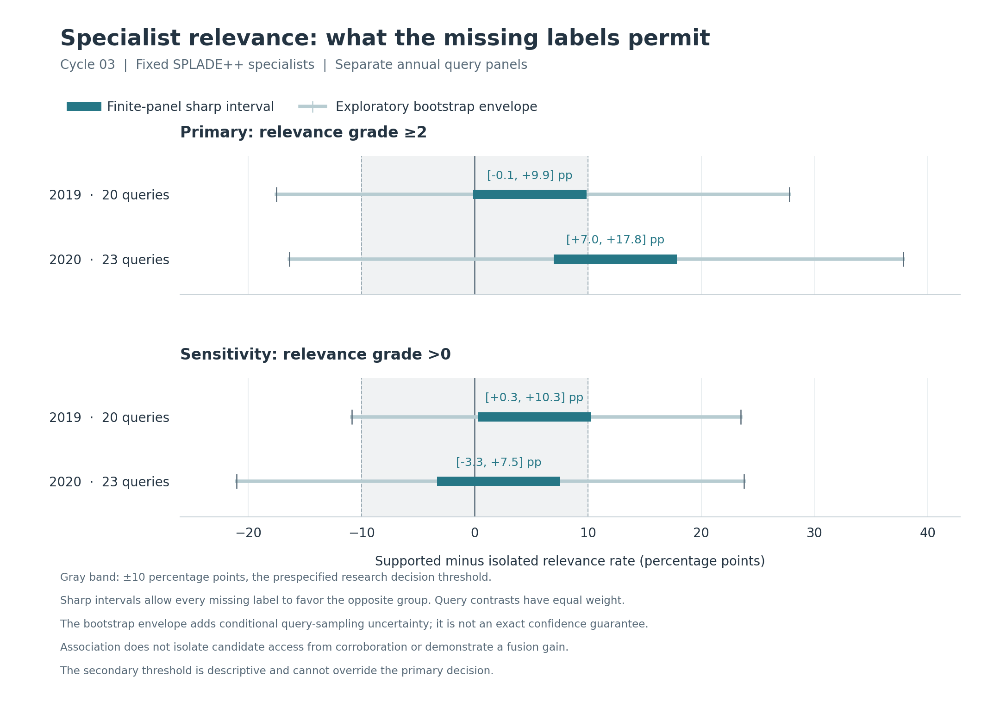

# Cycle03: the observed association does not clear the next-step gate

Both annual primary results are **inconclusive under the prespecified research
rule**. The new source made the specialist question better observed, but these
query panels still do not establish a stable, practically large relevance
association. The protocol therefore stops this association branch and moves
the next design effort to a controlled task with known truth and evidence origin.
This is a resource decision, not a finding that specialists are useless.

The [protocol](../../_sessions/cycles/2026-09-10-cycle03-specialist-association-protocol.md)
was committed in `3b7d148` before this source/cohort's outcome analysis. Its
candidate groups, eligibility, outcomes, resampling, practical threshold, and
stopping rule were unchanged. No fusion algorithm was trained or evaluated.

## What was compared

The fixed full-arm SPLADE++ specialists from cycle02 belong to two groups:
tail-supported by at least one old lexical list below rank30, or absent from
every retained lexical list. Every specialist is in SPLADE's original top10
and outside every other source's original top30.

Use every query with at least one candidate in each group: 20 of 43 in 2019 and
23 of 54 in 2020. A query remains eligible even if a group is fully unjudged.
Excluding those queries would change the target population according to judgment
availability. Each eligible query receives equal weight; group document counts
do not determine query weights. The other queries remain in the saved inventory,
with explicit reasons for exclusion from this contrast.

The primary outcome is relevance grade at least2; grade greater than 0 is a fixed
descriptive sensitivity. Explicit grade 0 is known nonrelevant for both outcomes;
an absent judgment remains unknown. The comparator throughout is:

**tail-supported relevance rate minus isolated relevance rate**, averaged
within query before averaging across eligible queries.

## Results: two different sources of uncertainty

The **finite-panel sharp interval** allows every missing label to favor either
group. Its endpoints are attainable without assuming missingness is random.
The **bootstrap envelope** additionally resamples whole query pairs within each
year. It is a conditional exploratory summary, not a guarantee of exact 95%
coverage or a repair for prior development on these annual panels.

All values below are **percentage points**, not relative percentage changes.

| Outcome | Year / eligible queries | Finite-panel sharp interval | Exploratory bootstrap envelope |
| --- | --- | ---: | ---: |
| Primary: grade≥2 | 2019 / 20 | [−0.14, +9.86] | [−17.50, +27.78] |
| Primary: grade≥2 | 2020 / 23 | [+6.96, +17.83] | [−16.38, +37.83] |
| Descriptive: grade>0 | 2019 / 20 | [+0.28, +10.28] | [−10.83, +23.47] |
| Descriptive: grade>0 | 2020 / 23 | [−3.33, +7.54] | [−21.01, +23.77] |

For the finite set of 23 eligible 2020 queries and the primary outcome, even
the least favorable completion of missing labels leaves a positive association.
That is a valid local observation. It does not establish that another query
sample would retain the sign or a ten-point advantage: the corresponding
bootstrap envelope is substantially wider and includes both directions.

Missing-label interval widths are exactly 10.0 points in 2019 and about 10.87 in 2020,
the same for both outcome thresholds. These widths were independently calculated
from judgment membership before reading grades. This verified the expected
invariant and separated the amount of missing-label uncertainty from where
the observed outcomes placed each interval.



[Vector figure](association.svg) · [Plotting source](plot_association.py).
The figure reads saved values and embeds their exact numbers and source/script
hashes. Matplotlib is optional; the experiment and independent checker use the
Python standard library.

## Why the decision is inconclusive

The fixed project threshold is an absolute 10-point relevance-rate difference.
It expresses what association would justify another fusion-design cycle; it
is neither derived from RRF nor a predicted NDCG improvement. Advancing requires
the entire bootstrap envelope to exceed that threshold in the same direction
in both years. Neither annual primary result satisfies this rule.

The protocol also permits a “small under the chosen bound” result, but only
when the entire envelope lies inside ±10 points and its width is at most 10 points.
The primary envelope widths are about 45.28 and 54.20 points. Neither result meets
that criterion. Crossing zero therefore does **not** establish a negligible
association. The secondary outcome cannot override the primary decision.

This contrast also cannot explain a causal corroboration benefit. For these
SPLADE specialists, tail support is equivalent to membership in the retained
lexical candidate union. Source language overlap, owner-rank composition, access
to candidates, and the judgment process remain possible explanations. An
association would not alone prove that it adds useful information beyond RRF's
existing coverage credit, nor that a routing rule improves rankings.

## Verification and review

Before actual outcome access, the implementation's 16 synthetic tests passed.
An independent Fraction-based calculation enumerated 1,521 small group
configurations and 7,056 binary completions, verifying that the proposed bounds
attain every extreme. Tests also cover candidate-only eligibility, equal-query
weighting, threshold semantics, exact paired draws, decision boundaries,
malformed inputs, changes to frozen cohorts, and immutable evidence directories.

After the actual run, a separate checker reconstructed all 194 query/outcome rows
from the original qrels and frozen candidate IDs. It independently verified
group counts, exact rational endpoints, 20/23 query eligibility, both 10,000-draw
hashes, bootstrap quantiles/envelopes, primary labels, and the branch decision.
It imports no experiment implementation. Input/source hashes stayed unchanged.
[Synthetic receipt](../../_sessions/evidence/2026-09-10-cycle03-synthetic-check.json),
[independent reconstruction](../../_sessions/evidence/2026-09-10-cycle03-independent-check.json).

Claude's Fable coordinator and one Opus scout found no consequential code
or numerical discrepancy. The coordinator emitted a substantive memo before
its native run terminated at the configured budget; the receipt records that
termination rather than claiming success. We corrected a sign error in its prose
(the 2019 lower bound is slightly negative) and rejected composition as an
established explanation for differences between relevance thresholds.
[Review integration](../../_sessions/cycles/2026-09-10-cycle03-review-integration.md),
[native outcome receipt](../../_sessions/evidence/2026-09-10-cycle03-review-receipt.json).

**Next design:** a binary evidence fixture with known truth and exact enumeration.
Compare padding, copies, and fresh independent readings, crossed with a weak or
strong specialist. Include an optimal provenance-blind baseline, disclose that
trusted source lineage is extra information, and count the cost of fresh evidence.
This can expose both successful rescues and harm from protecting the wrong
minority. It will validate a laboratory; a Bayes advantage under stipulated
assumptions is not a discovery about real LLMs.
[Cycle04 design](../../_sessions/cycles/2026-09-10-cycle04-known-truth-design.md).
No cycle04 experiment has run at this checkpoint.

## Reproduce and inspect

From the repository root:

```bash
python3 -B -m unittest discover -s evaluation/tests -p 'test_cycle03_specialist_association.py' -v
python3 -B _sessions/tools/check_cycle03_evidence.py --synthetic-only
python3 -B evaluation/cycle03_specialist_association.py --output results/cycle03-reproduction/association
python3 -B _sessions/tools/check_cycle03_evidence.py --results results/cycle03-reproduction/association
```

The output path must be new; choose another fresh directory for subsequent
reproduction. Existing results are never replaced. No new download or model
call is needed. The manifest pins the original inputs, frozen observation
artifacts, code/tests, protocol, Python version, commands, Git state, and outputs.

- [Summary and branch decision](association/summary.json)
- [All-query evidence](association/per_query.json)
- [Completed manifest](association/manifest.json)
- [Implementation](../../evaluation/cycle03_specialist_association.py)
- [Independent checker](../../_sessions/tools/check_cycle03_evidence.py)

Historical inputs and cycle01/cycle02 evidence remain unchanged. No new fusion
gain, useful specialist weight, source independence, or agent-performance claim
is established by this cycle.

Validation: **83 tests pass** (54 research and 29 helper/acquisition tests).
The [final check receipt](../../_sessions/evidence/2026-09-10-cycle03-checks.json)
records protocol/input/output custody, independent reconstruction, plot metadata,
active local links, and ignored provider/runtime files.
