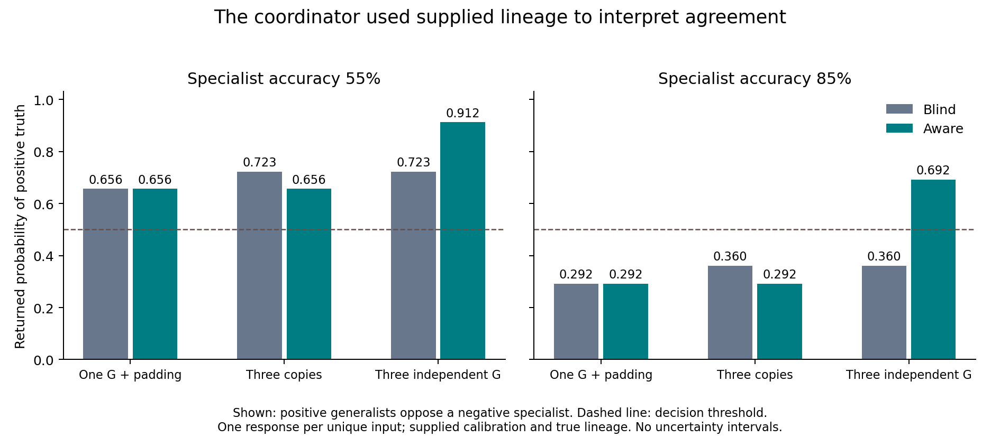

# Cycle05 replication — the coordinator used the supplied evidence model

All 20 fixed diagnostic requests returned valid probabilities. Every sign
decision matched its exact Bayesian reference, and the largest absolute
posterior error was **3.37017×10⁻⁸**. On these inputs, Opus5 at high effort used
known calibration, marginalized hidden lineage and distinguished copied from
independent agreement. It did not need proposer agents or a prompt search to do
so. This establishes behavior on one small, fully specified synthetic model;
it does not establish real-world calibration, reliable provenance or general
reasoning performance.

[Exact scores](scored/scores.json) · [Native observations](observations/responses.json) ·
[Collection manifest](observations/manifest.json) ·
[Protocol](../../_sessions/cycles/2026-09-10-cycle05-replication-protocol.md) ·
[Independent reconstruction](../../_sessions/evidence/2026-09-10-cycle05-independent-check.json)

[Exportable SVG](coordinator_probabilities.svg) · [Plotted values](plotted_values.json)

## What was measured

Truth is uniform±1. Three primitive generalists have symmetric accuracy 70%,
and the specialist has known accuracy 55% or 85%. Primitive readings are independent
conditional on truth. Three equally likely constructions show one generalist
plus padding, three copies of one generalist, or three independently acquired
generalists. Everyone knows the complete generative model. Aware requests gain
the true root partition, whose acquisition cost is not modeled.

The diagnostic set contains only packets in which all observed generalists
agree and oppose the specialist, at both sign orientations and reliabilities:
12 unique aware and 8 blind inputs. Copied and independent blind inputs coincide
and share one response. The exact generator weights condition on this selected
event separately by reliability. These are not20 sampled truth labels or20
independent scientific replications.

Twenty fresh native contexts used identical model/effort/prompt policies, empty
tools/MCP and no proposer agents. Payloads, order(seed 42), reference posteriors,
weights, parser, resource limits and source hashes were frozen before this
replication's calls. The [original stopped run](../cycle05-2026-09-10/REPORT.md)
is separate: a detector mistook all-zero agent counters for activity. Its one
response was not carried into this run. The correction and prior exposure are
disclosed; original artifacts and incomplete scores remain unchanged.

## Probability quality and information value

Primary is exact conditional excess Brier `(p-q)^2` against each view's own
posterior. A perfect calculation has zero regret in both views; additional
information lowers the ideal expected loss rather than necessarily reducing
the model's approximation error.

| Specialist | Blind excess Brier | Aware excess Brier | Blind expected Brier | Aware expected Brier | Aware minus blind |
| --- | ---: | ---: | ---: | ---: | ---: |
| 55% | 2.29914×10⁻¹⁶ | 8.50951×10⁻³⁶ | 0.211040397 | 0.203780708 | −0.007259689 |
| 85% | 3.10544×10⁻¹⁶ | 2.55714×10⁻³³ | 0.219636493 | 0.207226417 | −0.012410076 |

These are analytic expected losses of the returned probabilities under the
stipulated generator, conditional on the diagnostic event. They are not the
full-cycle04 mixture results. The paired decomposition's selection cross-term
is zero on the complete set; its approximation-error difference is negligible
at the displayed precision. No confidence intervals or p-values are inferred
from these designed packets.

Two blind outputs were rounded to seven decimal places, accounting for the
largest errors; the other outputs agree with their references at decimal
representation scale. All four aware copied-minus-padded probability changes
are exactlyzero in the returned decimals. In the 85% setting, the coordinator
follows the specialist against copies and the generalists against independent
corroboration. Sign symmetry holds up to the same decimal precision. These
contrasts describe the observed requests, not a universal capability guarantee.

## Compute and execution

| View | Unique invocations | Output tokens, including thinking | Reported thinking tokens | Native list accounting |
| --- | ---: | ---: | ---: | ---: |
| Blind | 8 | 2,048 | 1,910 | $0.087952 |
| Aware | 12 | 1,682 | 1,470 | $0.094947 |
| Total | 20 | 3,730 | 3,380 | $0.182899 |

Batch wall time was 83.84 seconds. Twenty distinct message IDs were observed,
all from canonical `claude-opus-5`, with no observed continuation/retry or actual
tool/agent activity. The largest per-message output was 433 tokens, below the
500-token response ceiling. Observed input:40 uncached,8,300 cache-write and
12,898 cache-read tokens. Native overhead/cache behavior is part of this fixed
workflow; these are not exact wire-prompt or complete transport-attempt counts.
The views have different invocation counts and metadata lengths, so equal
ceilings do not establish equal actual compute.

The stopped canary adds$0.014545, for **$0.197444 across the two empirical
batches**. Native list-price accounting is not subscription billing or a
conversion of usage allowance. Each batch retained its own$4 scheduling cap
and wall limits; the failed run was not resumed or overwritten. Any subsequent
scientific review is accounted separately.

## Decision

This test's supplied-model calculation is effectively saturated at the output
precision observed. Do not add agents or tune prompts on these same cases to
manufacture a gain. The next question should change the evidence available or
its reliability: can a coordinator use uncertainty about provenance instead of
treating metadata as infallible? The final review integration and next design
live in the shared planning and phase-space map. No next experiment is included
in these scores.
