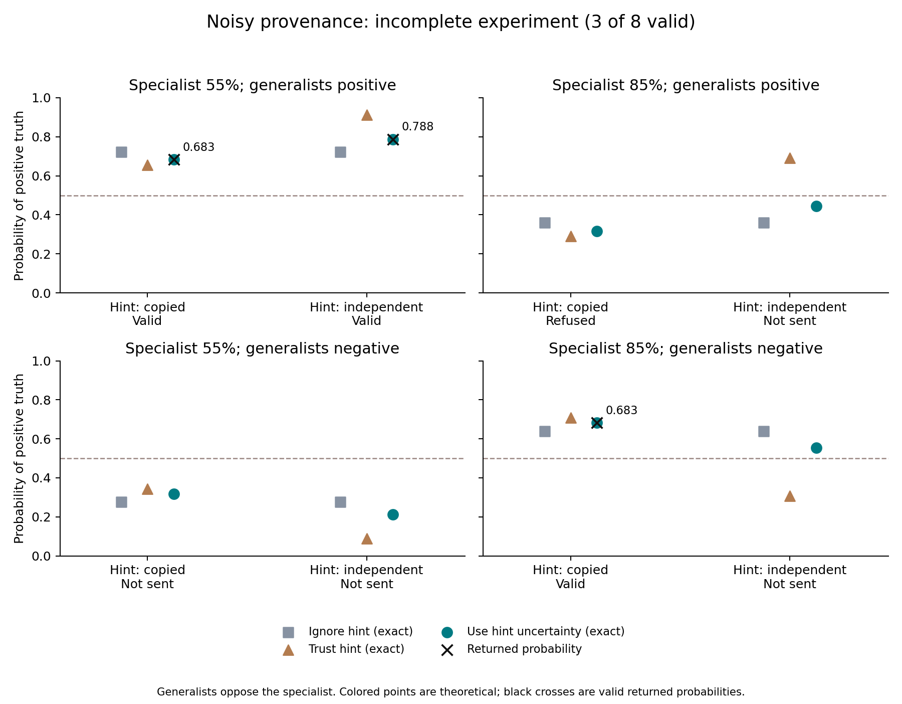

# Cycle06 — noisy provenance, incomplete empirical comparison

Three valid Opus5 responses closely approximate the stipulated noise-aware
posteriors. The fourth invocation ended with a provider refusal; the fixed
workflow stopped and never scheduled the remaining four inputs. **The eight-input
primary is null.** These three observations do not complete the intended test.

The two observed weak-setting inputs change the hint while retaining the same
readings. Their returned probability contrast is about0.104653455, close to the
noise-aware reference0.104653407; exact blind predicts zero and naive trust
predicts0.255984043. This is narrow evidence that the disclosed uncertainty was
used on those inputs. Both strong independent-hint cases, where naive trust
changes the class decision, were never sent. No general capability, calibration,
independence, retrieval improvement, or novelty claim follows.

## Frozen question and treatment

The [design](../../_sessions/cycles/2026-09-10-cycle06-known-noise-design.md)
predates every response. The cycle04 binary model supplies truth prior1/2,
generalist accuracy.7, specialist accuracy.55 or.85, and equal prior probability
of copied versus conditionally independent generalist constructions. On the
non-null unanimous-generalist disagreement event, a hint names the construction
correctly with probability3/4, independently of truth/readings given construction.
The construction itself remains hidden. The full law and hint error are supplied
to the coordinator; this measures use of known assumptions, not their acquisition.

Two specialist accuracies ×two signs ×two hints produce eight unique packets.
The primary is generator-weighted conditional excess Brier against noise-aware
Bayes, separately for each specialist accuracy. Exact blind and naive hint trust
are named comparators. Boundary calculations at hint error0 and1/2 and the
padded construction are analytical checks, not extra model observations.

The [execution protocol](../../_sessions/cycles/2026-09-10-cycle06-execution-protocol.md)
pins Opus5/high, fresh contexts, disabled tools/MCP/workflows/fallback, a500-token
per-response output setting,120seconds per invocation,300seconds per batch and
$1 native scheduling allowance. It permits native continuation but no application
retry or automatic repair batch. Preparation/source hashes and a156-test
[preflight receipt](../../_sessions/evidence/2026-09-10-cycle06-preflight.json)
were written before the first call.

## Observations and changed denominators

| Specialist | Generalists | Hint | Returned positive probability | Exact noise-aware probability | Status |
| --- | --- | --- | ---: | ---: | --- |
| 55% | positive | copied | 0.683165500 | 0.683165548 | valid |
| 55% | positive | independent | 0.787818955164 | 0.787818955043 | valid |
| 85% | negative | copied | 0.682563400 | 0.682562370 | valid |
| 85% | positive | copied | — | 0.317437630 | provider refusal |
| 55% | negative | copied | — | 0.316834452 | not sent |
| 85% | positive | independent | — | 0.444701646 | not sent |
| 85% | negative | independent | — | 0.555298354 | not sent |
| 55% | negative | independent | — | 0.212181045 | not sent |

All three valid class decisions match their references. Maximum absolute
probability error is1.02994×10⁻⁶. There is one completed hint contrast and no
completed opposite-sign pair. No missing probability is imputed.

The following summaries are **only on each row's valid inputs**, with its own
renormalized generator weights. They are not the complete primary or sampled
label estimates. Brier loss is evaluated directly against the exact conditional
truth law; no confidence intervals or capability threshold are assigned.

| Specialist | Valid / planned | Covered diagnostic mass | Returned expected Brier | Exact blind Brier | Naive trust Brier | Excess over noise-aware Bayes |
| --- | ---: | ---: | ---: | ---: | ---: | ---: |
| 55% | 2/4 | 1/2 | 0.197704643 | 0.200285838 | 0.204040500 | 1.43362×10⁻¹⁵ |
| 85% | 1/4 | 481/1448 | 0.216670981 | 0.218495493 | 0.217335124 | 1.06077×10⁻¹² |



[SVG](noisy_lineage.svg), [plotted values](plotted_values.json),
[exact scores](scored/scores.json). Colored markers are theoretical, including
on unsent inputs. Black crosses denote actual valid returned probabilities.

## Native failure and independent correction of its interpretation

Four invocations consumed57.71seconds and$0.173296 in native list accounting.
The raw streams contain10 provider message IDs and one locally generated API
error record. Aggregate output is4,386tokens, including4,328thinking tokens;
six provider messages stop at `max_tokens`. The500-token setting is per response,
not a500-token total workflow ceiling. Hidden transport attempts are not fully
observable. There is no evidence that truncation caused the subsequent refusal.

The failed invocation reports `model_refusal_no_fallback` with category
`reasoning_extraction`, exit1, `is_error:true` and terminal stop `refusal`.
The actual request asked for a JSON probability. The category records the
provider's classification; it does not establish a terms violation or explain
why this task was refused. No alternate provider model was observed.

The frozen collector misread “no_fallback” as fallback and treated a known local
`<synthetic>` API-error record as another provider model. That local record also
received cumulative usage/stop metadata belonging to the preceding real provider
message. The [independent audit](../../_sessions/evidence/2026-09-10-cycle06-independent-check.json)
preserves the exact discrepancies. Aggregate accounting, valid probabilities and
direct-loss arithmetic agree. The genuine native failure still requires exclusion;
the batch remains incomplete regardless of those misleading extra labels.

Original observations/scored artifacts remain unchanged. A separately tested
[future observer](../../_sessions/tools/native_stream_observer.py) recognizes
the precise correlated local error shape and records refusal separately from
model switching. Offline replay is distinct from a new native experiment; no
repair batch was launched. This correction does not prevent provider refusals.

## Review, decision and reproduction

Independent reconstruction performed865 checks including all four private raw
streams; public-only reconstruction performs739 checks and explicitly cannot
verify private raw bytes. The status records documented instrument discrepancies,
not unqualified agreement of every telemetry field. Prepared inputs, source
custody, exact laws and all direct-loss outputs agree.

A fresh tools-disabled Fable5.1 review completed through Relay at$0.30278075,
making total native list accounting for this cycle$0.47607675. The review had the
synthetic capsule, not independent access to code/raw streams. Its complete public
text was recovered from assistant text blocks because the terminal result
contained only the final acknowledgment-request fragment. Consumption ACK39
follows request35 and lifecycle36–38; no provider job or pending signal remains.

The [integration](../../_sessions/cycles/2026-09-10-cycle06-review-integration.md)
corrects two reviewer overstatements and selects
[cycle07 observation feasibility](../../_sessions/cycles/2026-09-10-cycle07-observation-design.md).
The next question is whether an affordable mechanically verified task panel
exhibits observable shared and differing agent errors. Fresh contexts do not
guarantee independent errors. H8 remains incomplete; another supplied Bayes table
is parked rather than treated as either a success or a model failure.

Offline commands from the repository root:

```bash
python3 -B -m unittest discover -s evaluation/tests -v
python3 -B -m unittest discover -s _sessions/tools/tests -v
python3 _sessions/tools/check_cycle06_evidence.py --public-only
python3 _sessions/tools/plot_cycle06.py
```

Use the checker flags documented by its help for public-only or local raw
verification. Plotting optionally uses Matplotlib; numerical research and the
standard-library demo do not require it. Do not rerun the closed collector as a
continuation or overwrite the existing preparation/observation/scoring paths.
The [final checks](../../_sessions/evidence/2026-09-10-cycle06-checks.json)
record current validation and custody; earlier artifacts retain their original hashes.
